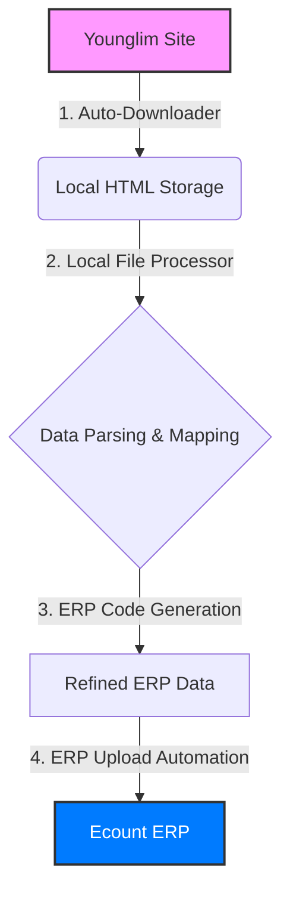

# 영림발주서 자동화 시스템 V5 (Hybrid Mode)

이 문서는 **V5 시스템(하이브리드 자동화)**의 구조, 워크플로우 및 사용법을 상세히 설명합니다.

---

## 🔄 전체 자동화 워크플로우

V5 시스템은 주문 수집부터 ERP 입력까지의 전 과정을 자동화합니다.

1.  **자동 다운로드 (Auto-Downloader)**: 30분마다 영림 사이트에서 새로운 주문을 감지하고 내 컴퓨터(`data/downloads/`)에 저장합니다.
2.  **데이터 해석 (Processor)**: 저장된 HTML 파일을 분석하여 품목명, 규격, 색상 등을 추출하고 ERP용 코드를 생성합니다.
3.  **일괄 업로드 (Uploader)**: 사용자가 버튼을 클릭하면, 분석된 데이터를 이카운트 ERP 전용 팝업에 한 번에 입력합니다.

---

## 💻 사용 방법

### 1단계: 서버 실행
바탕화면의 **`run_v5_server.bat`** (또는 `ㅊㅊㅊㅊㅊㅊ`) 파일을 실행합니다. 검은색 터미널 창이 유지되어야 모든 기능이 작동합니다.

### 2단계: 웹 컨트롤 패널 접속
크롬 브라우저에서 다음 주소로 접속하세요:
👉 **[http://localhost:5000](http://localhost:5000)**

### 3단계: 기능 조작
화면의 두 가지 핵심 버튼을 활용합니다:

1.  **[▶ Start Auto-Downloader] (초록색)**
    *   **최초 1회 실행**: 영림 사이트 백그라운드 감시를 시작합니다.
    *   로그인이 필요한 경우 브라우저가 열리며, 로그인 후 터미널 또는 화면의 안내에 따라 진행하세요.

2.  **[⬆ Start Batch Upload] (파란색)**
    *   **ERP 데이터 입력**: 현재까지 다운로드된 모든 주문 중 **새로운 주문**만 골라 ERP에 입력합니다.
    *   작업이 완료되면 ERP 화면에 데이터가 채워집니다.

### 4단계: 마무리
*   ERP에 입력된 데이터가 정확한지 확인 후 **[F8] 저장**을 누르세요.
*   이미 처리된 주문은 `v4_history.json`에 기록되어 중복 업로드되지 않습니다.

---

## 📂 폴더 및 파일 구조

### 📁 주요 디렉토리
*   `data/downloads/`: 영림 사이트에서 수집된 주문서 HTML 파일이 날짜별로 보관됩니다.
*   `avast_automation_profile/`: 자동화를 위한 전용 브라우저 세션 정보가 저장됩니다.
*   `.venv/`: 시스템 실행을 위한 Python 가상 환경입니다.

### 📄 주요 핵심 파일
*   **`v5_auto_server.py`**: 시스템의 심장부입니다. 웹 서버와 자동 스케줄러를 구동합니다.
*   **`local_file_processor.py`**: 주문서의 복잡한 텍스트를 분석하여 ERP 코드를 생성하는 엔진입니다.
*   **`erp_upload_automation_v1.py`**: 이카운트 ERP 사이트 제어 및 데이터 전송을 담당합니다.
*   **`v4_history.json`**: 중복 업로드를 방지하기 위한 이력 관리 파일입니다.

---

## 🔧 고급 정보 및 문제 해결

- **로그 확인**: 에러가 발생하거나 상세 진행 과정을 보고 싶다면 터미널 창 또는 `server.log`를 확인하세요.
- **이미 업로드된 주문 재처리**: `v4_history.json` 파일에서 해당 주문 번호(출하번호)를 삭제하면 다시 업로드할 수 있습니다.
- **브라우저 충돌**: 아바스트 브라우저가 이미 열려있어 프로필 잠김 에러가 나면, 기존 브라우저를 닫고 다시 시도하세요.
