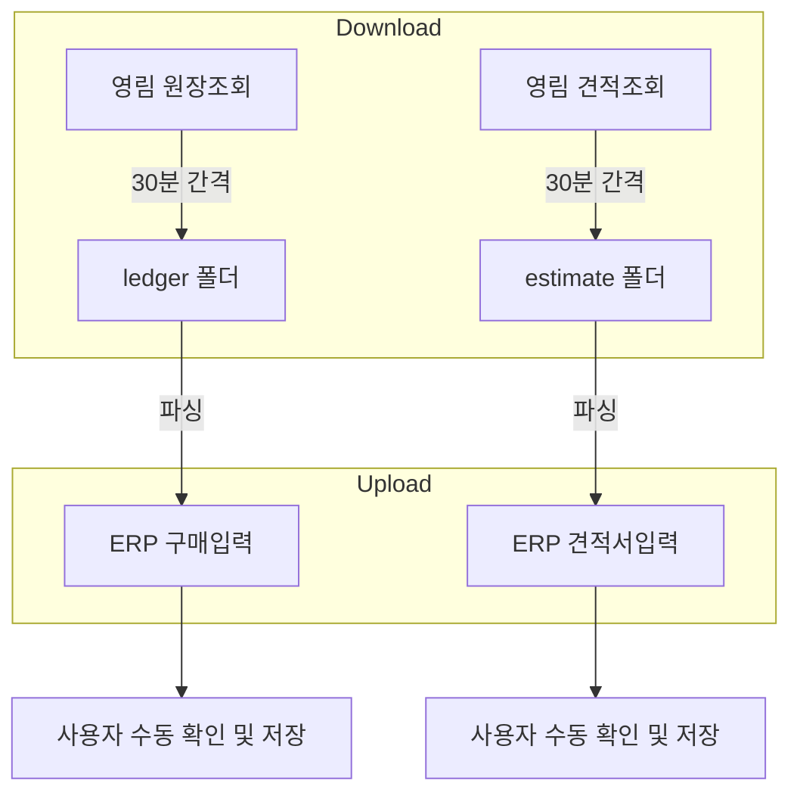

# 영림발주서 자동화 시스템 V6 (Dual Source Mode)

V5의 모든 기능을 유지하면서, **원장조회**와 **견적조회** 두 가지 소스에서 데이터를 수집하고, 각각 **구매입력**과 **견적서입력**에 업로드하는 시스템입니다.

---

## 🔄 전체 자동화 워크플로우



---

## 🚀 주요 변경점 (V5 → V6)

| 항목 | V5 | V6 |
|---|---|---|
| **다운로드 소스** | 원장조회만 | 원장조회 + 견적조회 |
| **저장 폴더** | `data/downloads/` | `data/downloads/ledger/` + `data/downloads/estimate/` |
| **업로드 대상** | 구매입력만 | 구매입력 + 견적서입력 |
| **서버 시작 시** | 수동 버튼 클릭 | **자동 다운로더 활성화** |
| **스케줄링** | 수동 | Windows 작업 스케줄러 (6AM 시작, 5PM 종료) |

---

## 💻 사용 방법

### 옵션 A: 수동 실행
1. `run_v6_server.bat` 실행
2. 브라우저에서 `http://localhost:5000` 접속
3. 업로드 버튼 클릭

### 옵션 B: 완전 자동화 (권장)
1. **최초 1회**: `setup_scheduler.bat`를 **관리자 권한으로** 실행
2. 이후 매일 오전 6시에 자동 시작, 오후 5시에 자동 종료

---

## 🎛️ 웹 컨트롤 패널

`http://localhost:5000` 에서 다음 버튼을 사용할 수 있습니다:

| 버튼 | 기능 |
|---|---|
| **▶ Start Auto-Downloader** | 원장+견적 30분 간격 감시 시작 (서버 시작 시 자동 활성화) |
| **⬆ Upload Ledger (구매입력)** | 원장 데이터 → ERP 구매입력 페이지에 붙여넣기 |
| **⬆ Upload Estimate (견적서입력)** | 견적 데이터 → ERP 견적서입력 페이지에 붙여넣기 |

---

## 📂 폴더 구조

```
매장자동화/
├── v6_auto_server.py          # V6 메인 서버
├── run_v6_server.bat           # 서버 시작
├── stop_v6_server.bat          # 서버 종료
├── setup_scheduler.bat         # 작업 스케줄러 등록
├── v6_history.json             # 처리 이력 (ledger/estimate 분리)
├── erp_upload_automation_v1.py # ERP 업로더 (target_type 지원)
├── local_file_processor.py     # HTML 파싱 엔진
└── data/
    └── downloads/
        ├── ledger/             # 원장조회 다운로드
        │   └── YYYY-MM-DD/
        └── estimate/           # 견적조회 다운로드
            └── YYYY-MM-DD/
```

---

## 🔧 문제 해결

### Q. 견적조회 페이지에서 다운로드가 안 돼요.
A. `v6_auto_server.py`의 `ESTIMATE_LIST_URL` 변수가 올바른 URL인지 확인하세요. 현재 `estimate_list.jsp`로 설정되어 있으며, 실제 URL과 다를 수 있습니다.

### Q. 작업 스케줄러가 동작하지 않아요.
A. `setup_scheduler.bat`를 **관리자 권한으로** 실행했는지 확인하세요. 작업 관리자에서 "V6_Server_Start", "V6_Server_Stop" 작업이 등록되어 있는지 확인하세요.

### Q. 중복 업로드가 되나요?
A. 아니요. `v6_history.json` 파일에서 ledger와 estimate를 각각 관리하여 중복을 방지합니다.
