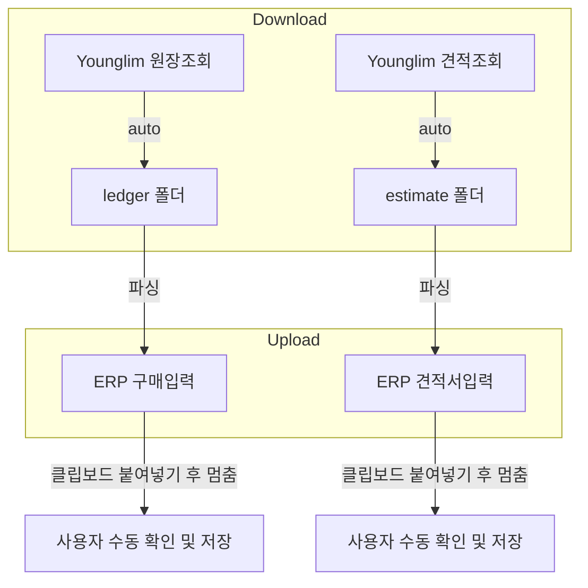

# V6 하이브리드 자동화 시스템 구현 계획

V5의 모든 기능을 유지하면서, **두 개의 다운로드 소스**와 **두 개의 ERP 업로드 대상**을 지원하는 V6 시스템을 구현합니다.

---

## 1. 시스템 개요

### 기존 유지 (V5 기반)
- 웹 컨트롤 패널 (`localhost:5000`)
- 30분 간격 자동 다운로드 스케줄러
- 로컬 파일 파싱 및 ERP 코드 생성 로직
- `v4_history.json` 기반 중복 방지

### V6 변경 및 추가 사항
1.  **다운로드 소스 분리**: 원장조회 + 견적조회
2.  **ERP 업로드 대상 분리**: 구매입력 + 견적서입력
3.  **웹 UI 버튼 추가**: 업로드 버튼 2개로 분리
4.  **내비게이션 최적화**: ERP 업로드 시 해시(#) 변경 방식에서 전체 URL 이동 방식으로 개선 (새 탭 대응)
5.  **영림 사이트 진입점 변경**: `main.jsp`를 통한 안정적인 세션 유지

---

## 2. 다운로드 소스 분리

| 소스 | 영림 사이트 페이지 | 저장 폴더 |
|---|---|---|
| **원장조회** | `ledger_list.jsp` (기존) | `data/downloads/ledger/YYYY-MM-DD/` |
| **견적조회** | `estimate_list.jsp` (신규) | `data/downloads/estimate/YYYY-MM-DD/` |

---

## 3. ERP 업로드 대상 분리

| 다운로드 소스 | 업로드 ERP 메뉴 | URL Hash (prgId) |
|---|---|---|
| **원장조회** 데이터 | **구매입력** | `prgId=E040303` (기존) |
| **견적조회** 데이터 | **견적서입력** | `prgId=E040201` (신규) |

---

## 4. 워크플로우



---

## 5. 예상 UI 변경 (웹 컨트롤 패널)

| 기존 V5 | V6 |
|---|---|
| `[▶ Start Auto-Downloader]` (1개) | `[▶ Start Auto-Downloader]` (1개, 두 소스 모두 감시) |
| `[⬆ Start Batch Upload]` (1개) | `[⬆ Upload Ledger (구매입력)]` + `[⬆ Upload Estimate (견적서입력)]` (2개 버튼) |

---

## 6. Proposed Changes

### Core Files

#### [NEW] v6_auto_server.py
- `v5_auto_server.py` 기반으로 생성
- `AutoDownloader` 클래스 수정: 원장조회와 견적조회 두 페이지 순회
- **서버 시작 시 자동으로 다운로더 활성화** (버튼 클릭 불필요)
- `/trigger_ledger` 엔드포인트 추가: 원장 데이터 → 구매입력 업로드
- `/trigger_estimate` 엔드포인트 추가: 견적 데이터 → 견적서입력 업로드
- HTML 템플릿 수정: 업로드 버튼 2개로 분리, 상태 모니터링 표시

#### [MODIFY] erp_upload_automation_v1.py
- `navigate_to_target_page()`: 전체 URL(`https://...#hash`)로 `goto` 하도록 수정하여 새 탭에서도 정상 작동하도록 보장

#### [MODIFY] v6_auto_server.py
- `LOGIN_URL`을 `http://door.yl.co.kr/oms/main.jsp`로 변경
- `AutoDownloader`의 내비게이션 로직 강화 (로그인 확인 추가)

#### [NEW] run_v6_server.bat
- V6 서버 실행 배치 파일

#### [NEW] stop_v6_server.bat
- V6 서버 종료 배치 파일 (Python 프로세스 종료)

#### [NEW] v6_history.json
- 원장/견적 각각의 처리 이력 관리 (또는 기존 파일에 키 분리)

---

## 7. Windows 작업 스케줄러 자동화 (옵션 C)

담당자 개입 없이 완전 자동화를 구현합니다.

### 스케줄 설정

| 작업 | 시간 | 실행 파일 |
|---|---|---|
| **서버 시작** | 오전 6:00 | `run_v6_server.bat` |
| **서버 종료** | 오후 5:00 | `stop_v6_server.bat` |

### 워크플로우

```
[오전 6:00] Windows 작업 스케줄러
     └→ run_v6_server.bat 자동 실행
         └→ v6_auto_server.py 시작
             └→ AutoDownloader 자동 활성화 (30분 간격 감시)
                         ↓
[근무 중] 담당자는 웹 UI에서 업로드 버튼만 클릭
                         ↓
[오후 5:00] Windows 작업 스케줄러
     └→ stop_v6_server.bat 자동 실행
         └→ Python 프로세스 종료
```

### 스케줄러 등록 스크립트 (선택사항)

#### [NEW] setup_scheduler.bat
- Windows 작업 스케줄러에 시작/종료 작업을 자동 등록하는 배치 파일
- `schtasks` 명령어 사용

```batch
@echo off
REM 오전 6시 서버 시작
schtasks /create /tn "V6_Server_Start" /tr "C:\Users\DSAI\Desktop\매장자동화\run_v6_server.bat" /sc daily /st 06:00 /f

REM 오후 5시 서버 종료
schtasks /create /tn "V6_Server_Stop" /tr "C:\Users\DSAI\Desktop\매장자동화\stop_v6_server.bat" /sc daily /st 17:00 /f

echo 작업 스케줄러 등록 완료!
pause
```


---

## 7. Verification Plan

### 수동 테스트
1.  V6 서버 실행 후 `localhost:5000` 접속하여 UI 확인
2.  Auto-Downloader 실행 시 두 폴더에 파일이 분리 저장되는지 확인
3.  "Upload Ledger" 버튼 클릭 시 ERP 구매입력 페이지에 데이터 입력 확인
4.  "Upload Estimate" 버튼 클릭 시 ERP 견적서입력 페이지에 데이터 입력 확인
5.  중복 처리 방지 로직 동작 확인
